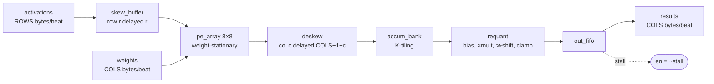

# systolic-tile

An **8×8 INT8 weight-stationary systolic array** for matrix multiplication —
the compute tile at the heart of an inference accelerator — verified bit-exact
against a Python reference model and built for two FPGA boards from one source
tree.

```
C[M][N] = requant( Σₖ A[M][K] · W[K][N] + bias[N] )
```

INT8 in, INT32 accumulate, INT8 out. 64 MACs per cycle.

[](https://github.com/3more102/systolic-tile/actions/workflows/ci.yml)

---

## The claim

Every number this design produces is **bit-identical to `model/golden.py`** —
including the awkward cases, like round-half-up on negative values and INT8
saturation. That is checked three ways:

1. **In simulation**, over 24 configurations covering K-tiling, ReLU, heavy
   saturation, single-beat streams, aggressive backpressure, and four array
   geometries including a non-square one.
2. **In the arithmetic unit specifically**, over 320 vectors that each carry
   their own quantisation config.
3. **On the FPGA itself** — the board runs the same vectors from ROM, compares
   against the same golden results, and lights one LED.

The model, the testbench and the hardware self-test all read the *same generated
files*. CI regenerates the committed FPGA ROMs and fails on any diff, so the
board can never end up self-testing against stale expectations.

---

## Results

### Simulation — 27/27 pass

```
$ make sim
=== tb_skew_buffer : LANES=6 W=8 ===                      RESULT: PASS
=== tb_requant : 320 vectors ===                          RESULT: PASS
=== tb_systolic_tile : 8 cases × 3 backpressure modes ===  RESULT: PASS  (×24)
=== tb_selftest : M=16 passes=4 relu=1 ===                RESULT: PASS

  all simulations passed
```

The tile runs at four array geometries, not just the 8×8 the boards build. The
`ROWS`/`COLS` parameters either work or they don't, and a repo that only ever
elaborates one size cannot tell you which:

| Geometry | Case | Measured pipeline depth | `ROWS+COLS+5` |
|---|---|---|---|
| 4×4 | `tiny` | 13 | 13 |
| 4×8 | `rect` | 17 | 17 |
| 8×8 | `basic`…`stress` | 21 | 21 |
| 16×16 | `wide` | 37 | 37 |

`rect` is the one that earns its place. Every other case is square, and a square
array hides a whole bug class — swapping `ROWS` for `COLS` in a skew depth, a
drain length or a bus width is a *no-op* when they are equal. At 4×8 each of
those is a different number, and the latency tracking `ROWS+COLS+5` across all
four sizes is independent evidence that the skew and the deskew are each reading
the parameter they should be.

All four are **structurally checked** too, not only simulated. Simulation shows
the other geometries *behave*; it says nothing about whether they *build*. So
`make lint` re-elaborates the design at each size and asserts the
multiply-accumulate count:

```
$ make lint
  yosys 8x8:   64 PEs, no latches, no undriven or multiply-driven nets
  yosys 4x4:   16 PEs, no latches, no undriven or multiply-driven nets
  yosys 4x8:   32 PEs, no latches, no undriven or multiply-driven nets
  yosys 16x16: 256 PEs, no latches, no undriven or multiply-driven nets
```

A latch inferred only at 4×8, or a net left undriven only at 16×16, now fails CI
instead of waiting for someone to try that size. The PE assertion is what makes
it more than a smoke test: a generate loop that bounds both dimensions with
`ROWS` builds a 4×4 array when a 4×8 was asked for, and 16 PEs where 32 were
expected is a hard failure rather than something to notice in a report.

Representative run — the hardest case with aggressive backpressure:

```
=== tb_systolic_tile : vectors/stress ===
    M=64 K=64 N=8 passes=8 mult=1040 shift=20 relu=0 bp=2
    beats checked  : 64 / 64
    stall cycles   : 146
    input bubbles  : 160
    clamping beats : 1
    RESULT: PASS
```

### Formal — 5 properties over every input sequence within 32 cycles

Simulation drives the stimulus somebody thought to write. `make formal` proves
the backpressure scheme over *all* of them within a bound, using the SAT solver
built into Yosys — no SymbiYosys, no SMT solver, no license, the same package the
lint job already installs:

```
$ make formal
  formal: 2x2, MAX_M=4, FIFO_DEPTH=8, 32 steps from reset
  cover  a result beat is produced
  cover  backpressure engages
  cover  the FIFO reaches its stall threshold
  proof  8 assertions hold over every input sequence of 32 steps
  self-test  an unqualified FIFO write is caught
```

The property that matters is **F1**. `out_fifo` masks its write with
`count < DEPTH`, and that mask is the only place in the design where a result can
disappear with nothing to show for it — no counter moves, no flag is raised, the
FIFO simply does not take the beat. Proving the mask is dead code is proving the
backpressure scheme.

Four of those five lines are not the proof, and they are the reason to trust it.
The **covers** ask the solver to *find* a trace that fills the FIFO, because a
bounded proof over a design that never reaches the interesting state is green and
worthless. The **self-test** re-runs the whole proof against a copy with the
`&& en` dropped from the FIFO write — the one documented hazard of this design —
and fails if it still passes.

That guard is not decoration. The violating state is only reachable deep into the
run, so a bound chosen by eye rather than measured would pass the broken design
and look exactly like a correct one.

Writing the freeze property exactly also turned up an exception worth knowing
about. Full write-up in
[docs/verification.md](docs/verification.md#the-formal-gate).

### Hardware

Both boards build and both close timing.

| | DE10-Standard | Zybo Z7-10 |
|---|---|---|
| Device | Cyclone V `5CSXFC6D6F31C6` | Zynq-7010 `xc7z010clg400-1` |
| Tool | Quartus Lite 18.1 | Vivado 2026.1 |
| Clock | 50 MHz | 125 MHz |
| Logic | 1,686 ALMs (4%) | 1,998 LUTs (11%) |
| Registers | 3,264 | 3,581 |
| DSP | 48 / 112 (43%) | 80 / 80 (100%) |
| Block RAM | 15 / 553 | 4 / 60 |
| **Timing** | **Fmax 100.5 MHz** — 2× margin | **met, WNS +0.508 ns** |
| Peak throughput | 3.2 GMAC/s | 8.0 GMAC/s |

Getting the Zynq there is the most interesting result in the repo. Vivado's
default mapping left all 64 PE multiply-accumulates in LUT and carry-chain
logic, and the design **missed 125 MHz by 96 ps**. Aggressive implementation
directives made it *worse* (−0.111 ns) — which is the useful signal: a path
strong directives cannot improve is a mapping problem, not a placement one.

`(* use_dsp = "yes" *)` on `mac_pe` maps `s_in + a_in*w_active` onto a DSP48E1
as `A*B + C → P` and fixes it outright:

| | fabric MAC | DSP48 MAC |
|---|---|---|
| Setup WNS @ 125 MHz | −0.096 ns (fails) | **+0.508 ns (met)** |
| Slice LUTs | 6,891 (39%) | **1,998 (11%)** |
| DSPs | 16 / 80 | 80 / 80 |

3.4× fewer LUTs *and* 0.6 ns of slack — paid for with the 7010's entire DSP
budget. Nothing else wanting a multiplier will fit on that part. Quartus needs
no such help: a Cyclone V DSP holds two 9×9 multipliers, so it packs all 64 PEs
into 48 blocks unprompted. Full analysis in
[docs/architecture.md](docs/architecture.md#timing).

**Prebuilt bitstreams** for both boards are committed in
[`bitstreams/`](bitstreams/), so you can program a board without installing a
vendor toolchain. Each carries its source commit, tool version, timing result
and SHA-256, all extracted from the build reports by
`scripts/collect_bitstreams.sh` rather than written by hand.

> Both bitstreams build from a clean clone, but neither has been programmed onto
> a physical board yet. The `PASS` LED is verified in simulation
> (`tb_selftest`), not on silicon.

---

## Quick start

Needs `iverilog`, `yosys`, `python3` + `numpy`. On Ubuntu:

```bash
sudo apt-get install -y iverilog yosys python3-numpy
```

Then:

```bash
make
```

That regenerates the vectors, runs every testbench, and runs the Yosys
structural check. Other targets:

```bash
make sim         # simulations only
make lint        # structural check, re-run at all four array geometries
make formal      # bounded model check of the backpressure scheme
make waves       # run a case with VCD output and open GTKWave
make check-roms  # verify committed FPGA ROMs still match the model
make check-pins  # verify both boards' pins against their board references
make quartus     # DE10-Standard bitstream
make vivado      # Zybo Z7-10 bitstream
make bitstreams  # collect both into bitstreams/ with provenance
```

---

## How it works



Each PE holds one weight and does one MAC per cycle. Activations flow west→east,
partial sums flow north→south, and both advance exactly one PE per cycle. That
only produces correct results if activations arrive on a *diagonal wavefront* —
row `r` delayed by `r` cycles — and the staggered column outputs are realigned
afterwards. [docs/architecture.md](docs/architecture.md) derives both delays
from first principles.

Three design points worth calling out:

**Weight double buffering.** Weights shift into a shadow register and are
committed to the active register in one cycle, so the next tile loads while the
current one still computes. *Gotcha:* the first beat pushed travels furthest, so
the stream must present array row `ROWS−1` **first**.

**K larger than the array.** A `K > 8` matmul splits into `ceil(K/8)` passes.
`accum_bank` keeps a running INT32 accumulator per output element in block RAM
and only releases results on the final pass.

**Backpressure without breaking the wavefront.** Full valid/ready handshaking
inside a systolic array is impractical. Instead the output FIFO's occupancy
drives one array-wide clock enable — everything freezes together, so nothing
loses alignment. The rule this imposes is that any consumer at the `en` boundary
must qualify with `en`, because a frozen producer holds its `valid` high.

---

## On-board self-test

Both board builds instantiate `tile_selftest`: it streams a canned matmul from
ROM, compares every result against the golden values, and reports one bit.

**DE10-Standard**

| Pin | Function |
|---|---|
| `KEY[0]` | reset |
| `KEY[1]` | re-run |
| `KEY[2]` held | enable hardware backpressure |
| `SW[7:0]` | select result byte (`beat*8 + lane`) |
| `LEDR[7:0]` | that byte |
| `LEDR[8]` | **PASS** |
| `LEDR[9]` | FAIL |

**Zybo Z7-10**

| Pin | Function |
|---|---|
| `btn[0]` | reset |
| `btn[1]` | re-run |
| `sw0` | enable hardware backpressure |
| `led[3:0]` | busy / done / **PASS** / FAIL |
| `LD6` green | PASS |

The self-test starts itself ~1 ms after configuration, so a freshly programmed
board shows a verdict with no interaction. Both status LEDs dark means it is
still running.

**Pin assignments are checked, not trusted.** A wrong pin is the worst class of
FPGA bug — it compiles, closes timing, programs, and then the board simply does
nothing, with no error to chase. So each board carries a checked-in pin table
and `make check-pins` diffs every assignment against it in CI:

| Board | Reference | Transcribed from |
|---|---|---|
| DE10-Standard | `syn/quartus/de10_standard_pins.ref` | Terasic's golden top, cross-checked against two published `.qsf` files and the User Manual |
| Zybo Z7-10 | `syn/vivado/zybo_z7_10_pins.ref` | Digilent's official `Zybo-Z7-Master.xdc` |

It also catches two signals landing on the same physical pin, which survives a
per-signal review and still cannot be routed, and — on the Xilinx side, where
the I/O standard is set per pin — an `IOSTANDARD` that disagrees with the bank.

---

## Layout

```
rtl/               mac_pe, pe_array, skew_buffer, accum_bank,
                   requant, out_fifo, tile_ctrl, systolic_tile
rtl/fpga/          self-test, board wrappers, generated ROMs
model/             golden.py (the specification), gen_vectors.py
tb/                4 self-checking testbenches
sim/               Makefile + generated vectors
fv/                lowering recipe for the bounded model check
syn/yosys/         structural check that runs in CI, at every geometry
syn/quartus/       DE10-Standard build (build_de10.tcl, .sdc, pin reference)
syn/vivado/        Zybo Z7-10 build (build_zybo.tcl, .xdc, pin reference)
bitstreams/        prebuilt .sof / .bit with provenance
docs/              architecture.md, verification.md
```

---

## Portability

The RTL is written to elaborate identically under Icarus 12, Yosys 0.52,
Quartus 18.1 and Vivado 2026.1: flat packed port buses, no packages or
interfaces, `localparam` state encodings instead of enums, and no size casts.

One portability bug is worth recording because only one of the four tools
catches it: with `` `default_nettype none ``, an `input logic` port leaves the
port's *net* type unspecified. Icarus, Yosys and Quartus accept it; Vivado
rejects it, correctly. All input ports are therefore declared `input wire`.

---

## What is not covered

Stated plainly — see [docs/verification.md](docs/verification.md#what-this-does-not-prove)
for the full list. In short: the formal proof is bounded at 32 cycles and one
geometry and says nothing about the datapath, there is no gate-level simulation,
only the 8×8 build is put through a vendor tool (the other geometries are
simulated and structurally checked, so they have no timing or utilisation
result), and nothing has run on physical hardware yet.

---

## License

MIT — see [LICENSE](LICENSE).
